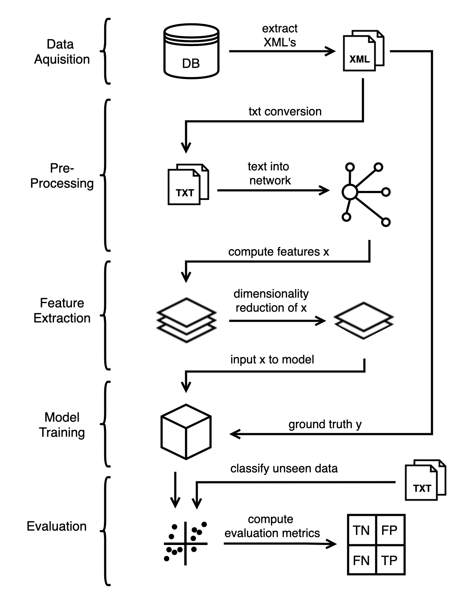
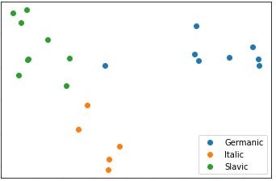
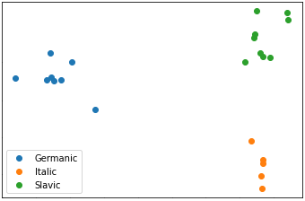

# Complex-Networks
Set of Python projects related to complex networks implemented for the course of "Complex Networks"  

# [A1. Structural descriptors of complex networks](A1)  
Calculation of structural descriptors of complex networks given several undirected complex networks in Pajek format (*.net), grouped in three categories: 
toy (sample networks), model (networks generated from models), and real (real networks). 
The objective was the calculation of the main structural descriptors for all networks.
* Numerical descriptors of networks
    * Number of nodes
    * Number of edges
    * Minimum, maximum and average degree
    * Average clustering coefficient (average of the clustering coefficient of each node)
    * Assortativity
    * Average path length (average distance between all pairs of nodes)
    * Diameter (maximum distance between nodes in the network)

* Numerical descriptors of the nodes of the network real/airports_UW.net
    * Degree
    * Strength
    * Clustering coefficient
    * Average path length (average distance to the rest of the nodes)
    * Maximum path length (maximum distance to the rest of the nodes)
    * Betweenness
    * Eigenvector centrality
    * PageRank

# [A2. Models of complex networks](A2)  
Implementation of models and generators of complex networks for the following models of complex networks (sorted by increasing difficulty):
* Erdös-Rényi (ER) networks, both G(N,K) and G(N,p)
* Watts-Strogatz (WS) small-world model
* Barabási & Albert (BA) preferential attachment model
* Configuration Model (CM)

# [A3. Community detection](A3)
Applying various different community detection algorithms, i.a. based on the optimization of modularity, for the given undirected networks using freely available software.
Following community detection algorithms were used:
* Fast-greedy algorithm
* Louvain algorithm
* Leiden algorithm

The objective was to compare the partitions obtained with the different algorithms, to try to conclude which is the best method.
In order to compare partitions with reference obtained from external information following standard measures were used:  
* Jaccard Index 
* Normalized Mutual Information (arithmetic normalization)  
* Normalized Variation of Information

# [A4. Epidemic spreading on complex networks](A4)
Epidemic spreading using the Susceptible-Infected-Susceptible (SIS) model by performing
Monte Carlo simulation of an epidemic spreading dynamics in complex networks, using the SIS model in which each node represents an individual which can be in two possible state: 
Susceptible (S), i.e. healthy but can get infected and Infected (I), i.e. has the disease and can spread it to the neighbors.
The objective was the calculation of the fraction of infected nodes, ρ, in the stationay state, as a function of the 
infection probability of the disease β, for different
* values of the recovery probability μ (e.g. 0.1, 0.5, 0.9) 
* undirected networks (e.g. Erdös-Rényi, scale-free, real), 
* sizes (at least 500 nodes), 
* average degrees, exponents, etc. 
Finally the ρ(β) results from Monte Carlo simulations were compared with the theoretical prediction provided by the Microscopic Markov Chain Approach (MMCA) model.  

Monte Carlo simulations may require a lot of computing time, thus it was recommended to use compiled languages. 
Therefore, first tests were made using Python with small networks, few time steps and few repetitions and then the definitive simulations were performed using C++.

# [A5. Structural descriptors in language classification models](A5)
Development of a project in which one put in practice the knowledge acquired during the course on Complex Networks. 
There were three types of projects to choose from:
* Analysis: obtaining real data which can be put in terms of networks, and analyzing it to answer any kind of question or hypothesis about them
* Model: developing a model of a complex network or dynamics on it, performing Monte Carlo simulations, obtaining analytical results and extracting some kind of conclusions 
* Algorithm: developing new computational algorithm for the analysis of the structure of complex networks  

The type of project chosen for the project was the analysis of the structural descriptors of language models in the language family classification task.
The hypothesis was to find out weather or not the structural descriptors retrieved from language models can be used as input to train an accurate language family classifier.

## Method
This section covers the following standard steps necessary to build and evaluate the classifier. 
The program was implemented in Python, utilising the library igraph for network-related tasks. 
A simplified overview of the process can be seen below.  

## Data Acquisition
Data from different language groups were needed to generate networks. 
The site [http://christos-c.com/bible/](http://christos-c.com/bible/)
freely provides a multilingual parallel corpus created from translations of the Bible. 
This website effort to create a parallel corpus containing as many languages as possible that 
could be used for a number of NLP tasks. Using the Book, Chapter and Verse indices the corpus is 
aligned at a sentence level. The dataset contains the Bible in 100 different languages, along with information about each 
language. Each Bible is available in XML-format, where each verse is in a separate tag.
To narrow it down and make the classification a bit more challenging, only European languages
where collected from the data. For example, comparing European languages to Asian languages
would be too easy due to their differences. The New Testament was the only book available in all European languages, and therefore it was
chosen as the main data. Even if each language could be represented

## Pre-Processing
The pre-processing covers the following steps (in order):  
1. **Parsing and format conversion**  
Each XML-file is parsed and the verses are extracted and appended into a plain text file,
one verse per row.
2. **Removing characters**  
Characters such as numbers and punctuation marks are removed to clean the text from
unnecessary information.
3. **Lower-casing**  
Lower-casing of all text.
4. **Words into nodes**  
Mapping words to nodes, represented as integer identifiers.
5. **Relation to edges**  
For each word represented as a node, an edge is created between the word and its consecutive
word.
6. **Language family and sub-family**  
The genus (language family: Germanic, Italic and
Slavic) and sub-genus (sub-family: Italic-Romance, Germanic-West, Slavic-South, Germanic-
North, Slavic-West, Slavic-East) are extracted and represented as integer identifiers. These
two families will be the prediction goals of the classifications.

## Features
The following scalar metrics (single value) were extracted as features:
* **Vertices count** - the total number of nodes in the network.
* **Edges count** - the total number of edges in the network.
* **Density** - the amount of actual connections divided by the potential connections. Potential 
connections are calculated by n∗(n−1)/2, where n represents the total number of nodes.

* **Transitivity** - The number of triangles in the network divided by the number of connected triples in 
the network. A triangle is made when node x is connected to node y and z, and y and z are also 
connected. A transitivity score of 1 implies that the network has all edges possible.
* **Assortativity degree** - Measures the similarities between nodes in terms of their degree, if
high degree nodes connect to other high degree nodes, and vice versa for low degree nodes.
* **Local transitivity average** - The transitivity average per node.

Additionally, the following average metrics where calculated:
* **Degree** - Average number of edges per node.
* **Page rank** - Average of subsets of edges that contains at minimum one edge of every cycle
in the network.
* **Coreness** - Average coreness over all nodes. The k-core is the maximal sub-graph where the
degree of the nodes is ≥ k. If the node belongs to k and not k+1, the nodes coreness is k.
* **Hub score** - The hub score is calculated by turning the network into an adjacency matrix A,
and retrieving the principal eigenvector of A*t(A).
* **Constraint** - Average of Burt’s Constraint that measures how connected a nodes neighbour
are towards the nodes other neighbours.
* **Feedback arc set** - The minimal set of nodes that makes the network acyclic when removed.
The sum of nodes is then averaged.

## Dimensionality Reduction
The results of the dimensionality reduction can be observed below. Both of the used methods 
enforce a clustering of the data that is visually meaningful despite the large reduction in
dimensionality.  
### Linear Discriminant Analysis (LDA)

### Neighborhood Components Analysis (NCA)

## Further Work
Possible improvement and future work could be:
* **Different dataset**
* **Additional pre-processing**  
nltk has different language packages for preprocessing which could be applied. However, in
our case the language expressed in the bibles can be out-dated and not well-processed by
the nltk packages.
* **Additional features**  
Adding additional network descriptors as features, or combining with non-network descrip-
tors as features. Possible additional descriptors are for example: eigenvector centrality,
similarity jaccard, similarity dice, etc.
* **Features combinations**  
Additional exploration of the feature-spece, like using different setups for comparison or
finding best feature combination.
* **Additional fine-tuning of hyper-parameters**  
The grid-search search-space could be expanded to include further hyper-parameters and/or
increased iterations. As noted before, some models performed worse during grid search. The
SMOTE and LDA could be included to make sure that they do not negatively impact the
results.
* **Explainability**  
There are more explainability-modules available, which could be applied to achieve a
better understanding of the resulting models.